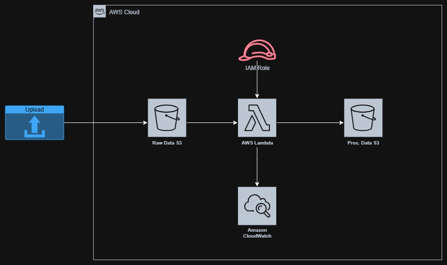

# AWS Serverless Data Pipeline with Terraform

## Project Summary
I built this project to show a simple but secure AWS serverless data pipeline using Terraform.  
The idea is straightforward: a file lands in an S3 bucket, a Lambda function processes it, and the result goes into another S3 bucket.  
Everything is defined as reusable Terraform modules so it’s easy to clone or extend later.


---

## Deliverables
Here’s what’s inside the repo:

- **Terraform Scripts** – IaC setup for S3, Lambda, IAM, and CloudWatch.  
- **Lambda Code** – Python script that transforms the uploaded data.  
- **Documentation** – This README that explains the architecture and key decisions.  
- **Architecture Diagram** – `ikerian-diagram.jpg`, showing the data flow.

---

## 1. Project Structure

I kept the Terraform setup modular so it’s easy to deploy the same stack in different environments (like `dev` and `prd`).

```
|-- dev
|   |-- backend.tf          # Remote State Configuration (S3 backend settings)
|   |-- lambda_code         # Local source code for the Lambda function
|   |   |-- handler.py      # Python transformation logic
|   |   |-- handler.zip     # Zipped artifact ready for AWS deployment
|   |-- main.tf             # Main configuration in dev (calls all the modules)
|   |-- terraform.tfvars    # Variable values specific to the 'dev' environment
|   |-- vars.tf             # Variable declarations
|-- ikerian-diagram.jpg     # Architecture diagram
|-- modules                 # Reusable Infrastructure Modules
|   |-- iam                 # Module for IAM Role and Policy definitions
|   |   |-- main.tf
|   |   |-- outputs.tf
|   |   |-- vars.tf
|   |-- lambda              # Module for Lambda Function and CloudWatch setup
|   |   |-- cw.tf
|   |   |-- main.tf
|   |   |-- outputs.tf
|   |   |-- vars.tf
|   |-- s3                  # Module for S3 Bucket creation  
|       |-- main.tf
|       |-- outputs.tf
|       |-- vars.tf
|-- prd                     # Placeholder directory for the Production environment
|-- README.md
```

---

## 2. How It Works

Here’s the overall flow:

1. **Input:** A JSON file gets uploaded to the `raw-data-bucket`.  
2. **Trigger:** S3 sends an `s3:ObjectCreated:*` event.  
3. **Compute:** Lambda function runs using its IAM role.  
4. **Transformation:** The function reads the JSON, picks out only `patient_id` and `patient_name`, and creates a summarized JSON.  
5. **Output:** The new JSON is written to the `processed-data-bucket`.  
6. **Monitoring:** All logs go to a specific CloudWatch Log Group.

---

## 3. Technical Details & Key Choices

### A. Security and Logging
- **Least Privilege IAM:**  
  The Lambda role is limited — it can only read from the raw bucket, write to the processed bucket, and send logs to one Log Group.

- **Custom Log Group:**  
  I created a dedicated CloudWatch Log Group via Terraform instead of letting Lambda auto-create one. The IAM policy only allows writes to that specific group (better security and cleaner structure).

- **Structured Logging:**  
  Used Python’s `logging` module instead of `print()` — gives proper log levels (INFO, ERROR, etc.) and full stack traces when debugging.

### B. Terraform Setup
- **Remote State Management:**  
  The Terraform state is stored remotely in an S3 bucket (ek-eu-west-01-tf-state-bucket) with DynamoDB-based locking (terraform-locks) to prevent concurrent modifications.

- **Modular Design:**  
  The code is split into `s3`, `iam`, and `lambda` modules. Deploying to another environment is just a matter of calling these same modules again.

- **Provider Default Tags:**  
  The AWS provider is configured with default_tags. All resources created with Terraform will automatically inherit these tags, e.g., environment (env), owner (owner), project (project), and ManagedBy.

- **Explicit Dependencies:**  
  Added a `depends_on` where needed, so resources (like Lambda permissions) are ready before S3 notifications are registered.

- **Environment Management:**  
  Separate folders (`dev`, `prd`) and `terraform.tfvars` files make it easy to keep things clean between environments.

### C. Lambda & Project Practices
- **Environment Variables:**  
  The Lambda gets the target bucket name via an env var (`TARGET_BUCKET_NAME`), so the Python code stays generic.

- **Code Formatting:**  
  Ran `terraform fmt` to keep everything consistent.

- **S3 Write Strategy:**  
  Lambda writes output under `/processed_summary/` instead of the root — keeps things organized and avoids rate limit/permormance issues.

---

## 4. CI/CD Workflows
### A. Current CI/CD Features
- **Deployment Branches:**  
  The main deployment branches are dev and prd. These branches are protected and require manual approval before applying any infrastructure changes.

- **Automatic Triggers:**  
Every push to any branch triggers:

    - Trivy Static Security Scan: Runs static IaC and dependency security analysis. The scan results are stored as build artifacts.

    - Terraform Validate & Plan: Ensures Terraform syntax is valid and generates a human-readable plan (tfplan.txt) showing upcoming infrastructure changes.

- **Pre-Apply Summary and Cost Check:**  
  Before applying changes, the GitHub Actions Step Summary shows:

    - The Terraform plan (plain text, color-stripped for readability).

    - The Infracost cost estimation for all affected AWS resources.

- **Manual Deployment Approval:**  
 The terraform apply step requires manual approval through GitHub’s Deployment Environment Approval feature. This ensures that cost and plan outputs are reviewed before any changes are applied to AWS.

 - **Artifacts and Traceability:**  
 The following outputs are uploaded as workflow artifacts for transparency and reproducibility:

    - tfplan.binary – the compiled Terraform plan file.

    - tfplan.txt – the human-readable plan summary.

    - infracost.txt – the cost estimation report.

### B.Upcoming CI/CD Enhancements
- **Terraform Format (terraform fmt):**  
  Automatic code formatting to ensure consistent Terraform style and structure.

- **Terraform Docs (terraform-docs):**  
  Automated documentation generation from module inputs and outputs.

- **Branch Protection Rules:**  
  Stricter enforcement of branch protection on dev and prd — including required reviews, successful checks, and restricted direct pushes.

---
## Conclusion

Overall, this was a fun little project to put together.  
I didn’t run into anything too unexpected with AWS or Terraform, but I did spend some time improving the Python logging setup — hadn’t really used it in detail before.  
It ended up taking me a bit longer than the expected 1.5–2 hours. Most of the extra time went into polishing things — mainly making the logging cleaner, the Terraform modules more readable, and testing a few edge cases I hadn’t thought of at first.

I’ve just started publishing my projects publicly on GitHub (since Sept 1st), so it’s still early days — but you can check out more at **[erhankudretli.github.io](https://erhankudretli.github.io)**.

---

Thanks for reading!  
Happy to discuss more!

---